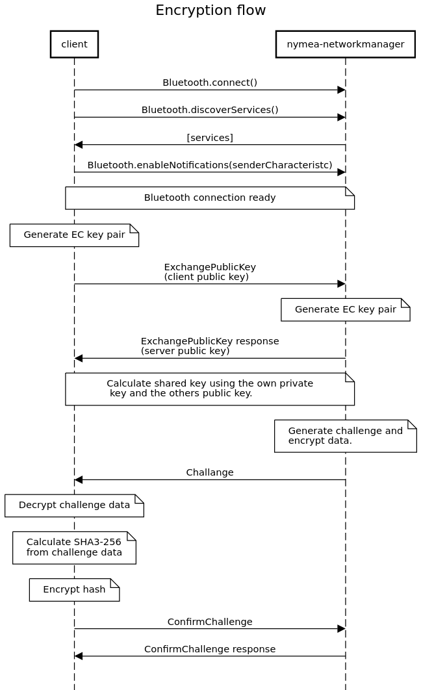

# nymea-bluetooth server

# Bluetooth GATT profile
-------------------------------------------

In order to connect to nymea-bluetoothserver using bluetooth low energy, once has to perform a bluetooth discovery, filter for all low energy 
devices and connect to the device with the name `nymea`. The bluetooth remote address type is `public`.

## Notifications

In order to enable/disable the notification for a characteristic with the `notify` flag, a client has to write the value `0x0100` for 
enabling and `0x0000` for disabling to the descriptor `0x2902` of the corresponding characteristic.

# Communication

Each service has a sender and a receiver characteristic. The receiver characteristic can be used to write data to the service, and the sender characteristic can be used to receive data from the service. In order to receive data, the notification has to be enabled using the client configuration descriptor as specified in the Bluetooth specification.

The maximum data length a characteristic can transport is `20` bytes. Most of the messages are longer than 20 bytes and have to be splitted up while sending or receiving.

In order to be able to split packages, the SLIP protocol has been implemented on each sender/receiver characteristic of the custom services, which makes the package splitting independent from the transfered bytes and has a very small data overhead.

More information about the SLIP protocol can be found [here](https://tools.ietf.org/html/rfc1055).

Independent if data are encrypted or not, a package will be streamed escaped according to SLIP using multiple indications on the approriate characterisitc (in both directions).

Also if the data is encrypted, the same mechanism will be used.

Once the *end package* byte has been received, the data has to be unescaped according to the SLIP protocol before processing the content.

# Encryption

The server offers a service which allowes to establish a ECDH encryption on all custom services. The entire communication with this service is *unencrypted*, and only one encryption can be established for one session.

If data will be sent encrypted, the message will begin with a 32 byte nonce (used for encrypting), followed by the encrypted data.

**Algorythm:**

- Key exchange: X25519
- Encryption: XSalsa20 stream cipher
- Authentication: Poly1305 MAC

# Services

| Name                      | Type    | Service UUID                           | Description
| ------------------------- | ------- | -------------------------------------- | ----------------------------------------------------
| Generic Access            | Spec.   | `00001800-0000-1000-8000-00805f9b34fb` | The service contains generic information about the device
| Generic Attribute         | Spec.   | `00001801-0000-1000-8000-00805f9b34fb` | Default service for Bluetooth LE GATT devices
| Device information        | Spec.   | `0000180a-0000-1000-8000-00805f9b34fb` | The service contains information about the device and manufacturer
| Encryption service        | Custom  | `56c8ae10-def5-4d9c-8233-795a32d01cd2` | The service for establishing an encryption (unencrypted traffic)
| Network manager service   | Custom  | `d918edd0-bdb8-4b4b-b7e1-b15d50d361a2` | The service for managing networks (encrypted traffic)

> There are 2 services, which are deprecated and remain for backwards compatibility. You can find more information about the deprecated services here [here](docs/Deprecated-services.md). It is strongly recommended to update to this bluetooth API and make use of the encryption feature.

> **S** = Service; **C** = Characteristic; **D** = Descriptor

> **W** = Write; **R** = Read; **N** = Notify

## **S**: Generic Access

> Default service for Bluetooth LE GATT devices. More information can be 
found [here](https://www.bluetooth.com/specifications/gatt/viewer?attributeXmlFile=org.bluetooth.service.generic_access.xml).

## **S**: Generic Attribute

> Default service for Bluetooth LE GATT devices. More information can be found [here](https://www.bluetooth.com/specifications/gatt/viewer?attributeXmlFile=org.bluetooth.service.generic_attribute.xml).

## **S**: Device Information

> Default service for Bluetooth LE GATT devices.  More information can be found [here](https://www.bluetooth.com/specifications/gatt/viewer?attributeXmlFile=org.bluetooth.service.device_information.xml).

## **S**: Encryption Service

UUID: `56c8ae10-def5-4d9c-8233-795a32d01cd2`

This service can be used to exchange the public keys and test the encryption. Once the encryption has been enabled, all custom services will make use of this encryption. The key is only valid during one session. If the client looses the connection to the server, a new encryption using a new key pair must be established.

**Characteristics**

- **C**: *Receiver* (W) `56c8ae11-def5-4d9c-8233-795a32d01cd2`

    - Access: `Write`
    - *Description*: Used to send commands to the encryption service.
    - *Encryption*: Always disabled. This channel will always be paintext.
    - *Range*: `[0-20]` Byte, UTF-8, JSON

- **C**: *Sender* `56c8ae12-def5-4d9c-8233-795a32d01cd2`

    - Access: `Ǹotify`
    - *Description*: Used to send responses and notifications from the encryption service.
    - *Encryption*: Always disabled. This channel will always be paintext.
    - *Range*: `[0-20]` Byte, UTF-8, JSON

In following example you can find the basic structure of a command and a response. The command can be sent to this *Receiver* characteristic, the response will be notified on the *Sender* characteristic. The JSON object containing the command map has to be formated **compact** to minimize the traffic. If a data package is longer than the allowed 20 Bytes, the data must be splitted into 20 Byte packages and sent in the correct order. Before the data will be written to the characteristic, it has to be escaped using the SLIP protocol, which makes it clear where the package ends.

- Request

                  {
                      "c": 0,           // Integer: Command: describing the method called
                      "p": { }          // The parameters of the method. If a method does not have any parameters, it should not be included.
                  }

- Response

                  {
                      "c": 0,               // Integer: Command: describing the method called
                      "r": 0,               // Integer: Response error code. See list of error codes.
                      "p": Object or Array  // Object or Array. This value is optional and depends on the requested command.
                  }

- Notification

                  {
                      "n": 0,           // Integer: Notification: describing the notification type
                      "p": { }          // The parameters of the notification. If a notification does not have any parameters, it should not be included.
                  }

### Encryption service flow

<!-- https://sequencediagram.org/
title Encryption flow

participant client
participant nymea-networkmanager

client->nymea-networkmanager: Bluetooth.connect()
client->nymea-networkmanager: Bluetooth.discoverServices()
nymea-networkmanager->client: [services]
client->nymea-networkmanager: Bluetooth.enableNotifications(senderCharacteristc)

note over client, nymea-networkmanager: Bluetooth connection ready
note over client: Generate EC key pair
client->nymea-networkmanager: ExchangePublicKey\n(client public key)
note over nymea-networkmanager: Generate EC key pair
nymea-networkmanager->client: ExchangePublicKey response\n(server public key) 

note over client, nymea-networkmanager: Calculate shared key using the own private\n key and the others public key.

note over nymea-networkmanager: Generate challenge and\nencrypt data. 

nymea-networkmanager->client: Challange
note over client: Decrypt challenge data
note over client: Calculate SHA3-256\nfrom challenge data
note over client: Encrypt hash
client->nymea-networkmanager: ConfirmChallenge
nymea-networkmanager->client: ConfirmChallenge response

-->

### Error codes

| Value  | Name              | Description
| ------ | ----------------- | ----------------------------------------------------
| `0`    | Success           | The request has been successfull. No error occured.
| `1`    | InvalidKey        | The given key has not the correct size.
| `2`    | AlreadyEncrypted  | There has already been established an encryption for this session.
| `3`    | EncryptionFailed  | The challange has not been decrypted correctly.

### Methods

| Value  | Name              | Description
| ------ | ----------------- | ----------------------------------------------------
| `0`    | ExchangePublicKey | Get the public key from the server and send the own public key along for creating a shared key.
| `1`    | ConfirmChallenge  | This method can be used to confirm the data from the challenge notification. The response informs about the success of the encryption.

#### ExchangePublicKey

Before using this method, the client has to generate an ECDH key pair. The key pair consists out of a public key and private key. The private key must *always* be kept secret, the public key must be sent to the server using this method.

Example request:

                  {
                      "c": 0,
                      "p": {
                          "pk": "bcd6c5c7600ed3a05cd8f899b7fe4d0cb4351d542ff5f12dbf24d00f6220986c"      // Public key from the client
                      }
                  }

Example response:

                  {
                      "c": 0,
                      "r": 0,
                      "p": {
                          "pk": "1dc9bf0f1ef881ce38cb5189c21131a2309a07a27307687c59fa73f8c155011f"      // Public key from the server
                      }
                  }

#### ConfirmChallenge

Right after the key exchange, the server will send a challenge notification containing encrypted data. Once the client receives that notification, the encrypted data will be decrypted using the sent nonce. The client will than calculate a SHA3-256 hash from the received content. The resulting hash will than be encrypted and send backt to the server using this method. The server will decrypt the the message, verify the SHA3-245 checksum form the challenge data. If everything is on, the encryption has been established successfully and all communication on the custom services can be used with encryption from this point on. If the encryption did not work for any reason, the client will be disconnected and the session is closed. 

Example request:

                  {
                      "c": 1,
                       "p": {
                          "n": "cdd6a71211e4ababecd716f761138ff39ead5797db38e26ed52a4cfedcb73b97",
                          "c": "1dc9bf0f1ef881ce38cb5189c21131a2309a07a27307687c59fa73f8c155011fb970fbf79a19075259422573a72580"      // Encrypted SHA3-256 challange data
                      }
                  }

Example response:

                  {
                      "c": 1,
                      "r": 0        // Error code. If success, the encrytion is established. If not, the client will be disconnected.
                  }

### Notifications

| Value  | Name               | Description
| ------ | ------------------ | ----------------------------------------------------
| `1`    | Challenge          | This notification will be sent after the key exchange in order to test the encryption.

#### Challenge

The challange notification will be sent right after the key exchange. The parameter property `c` contains an encrypted message using the nonce `n`. The challange content has to be decryted, than a SHA3-256 has has to be calculated from it and then send back to erver using the `ConfirmChallenge` method.

Example notification:

                  {
                      "n": 0,
                      "p": {
                          "n": "181fbd161c855876bad7ea8746c24e55dcb637c43882fc4df78fac9ce3951055",     // Nonce for the encryption (32 bytes random data used to encrypt the data). Never use a nonce twice.
                          "c": "6f83ab2ce8837812fc4222bb963eb76ac3bb4e6fcce8c668e4f7f390d65f9ce666c47159dc15000cc4daee1a13c27a37ca"      // Encrypted challenge content.
                      }
                  }

